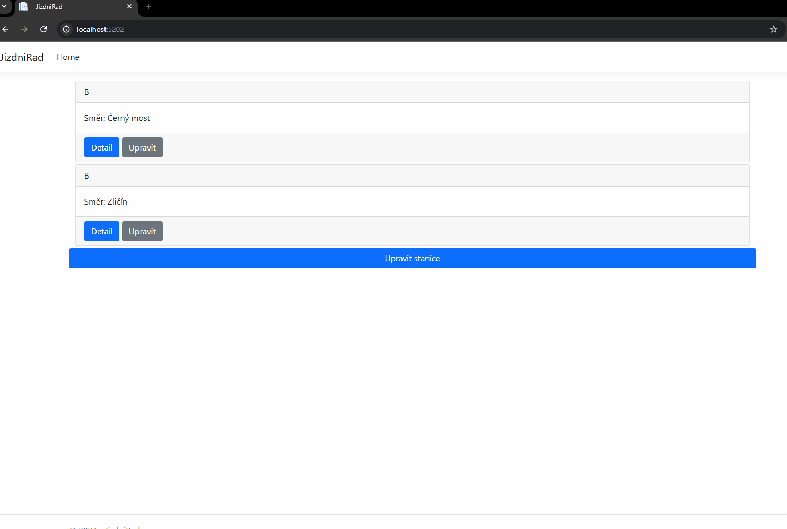

# Jizdni rad

 

## Description
ASP.Net app, This app replicates schedule board of Public transport in Prague [DPP](https://www.dpp.cz/#jizdni-rady-tab). Made it as a school project
 - Viewing schedule for line
 - Basic station and schedule editing
    - (Mainly done directly with db, not implemented in ui)
 - Can click through to a station, which recalculates the riding time to other stations and updates the schedule.

## Setup
 - Initialize the DB
    - Either the the [structure](./DB/db_structure.sql) and **your** data or use script with [structure and sample data](./DB/_db_Full.sql)
 - Add your connection string to [DbContext](./JizdniRad/JizdniRad/Context/DatabaseContext.cs)
  - Run it